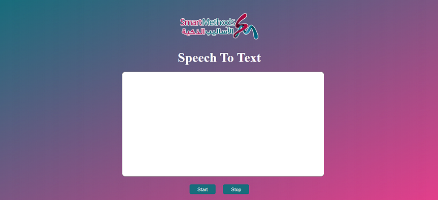

# Smart Methods Internship Task 1

### Task 1.1: Run and connect an ESP32 to Wi-Fi.
- The algorithms steps can be found in Task1.1/Task 1.1.pdf file. 

### Task 1.2: Speech to text website.
- Used Html, CSS, and javascript to build the website and Web Speech API for voice recognition.
- Web Speech API: https://developer.mozilla.org/en-US/docs/Web/API/SpeechRecognition
- Screenshot of the interface:

