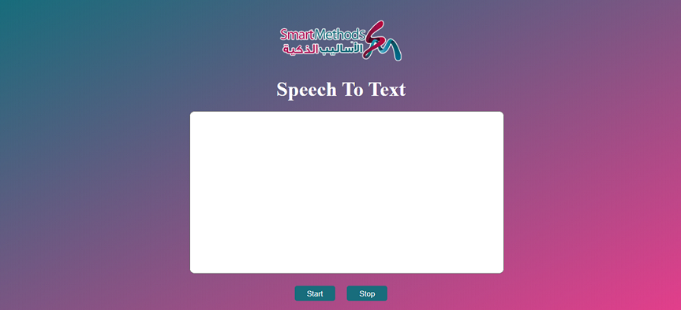

# Smart Method Internship Task 1

The first task in IOT and data science track consist of two parts.
the first part is to write an algorithms to run ESP32, the second part is to work on speech to text website.

### Task 1.2: Run and connect an ESP32 to Wi-Fi.
- The algorithms steps can be found in .pdf file. 

### Task 1.2: Speech to text website.
- Used Html, CSS, JavaScrite, and Web Speech API to accomplish the task.
- Screenshot of the interface:

